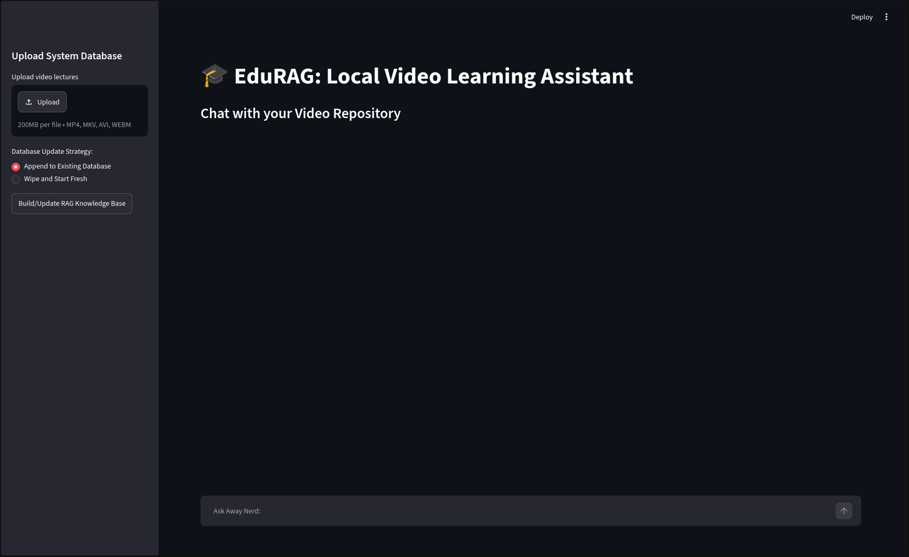
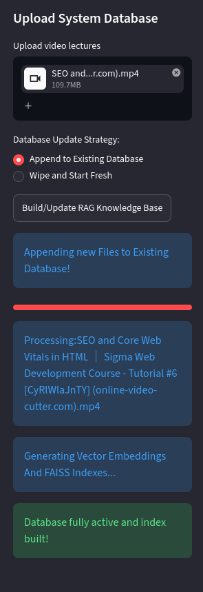
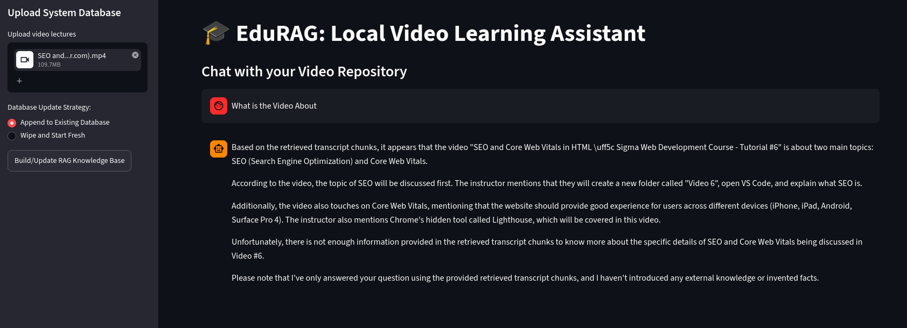
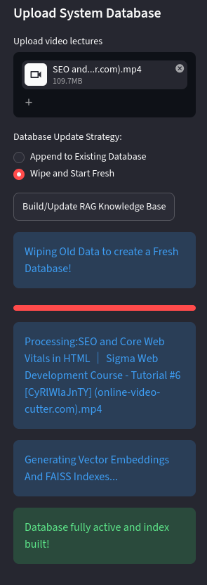

# 🎓 EduRAG

**EduRAG** is a fully local Retrieval-Augmented Generation (RAG)
application that transforms **any educational video collection** into an
AI teaching assistant.

Unlike many tutorial-based RAG projects that rely on pre-built
frameworks, EduRAG implements the complete ingestion and retrieval
pipeline from scratch using Whisper, FAISS, Ollama, and Streamlit.

> Upload your lectures, build a local knowledge base, and ask questions
> about the content without relying on cloud APIs.

---

# 📸 Application Preview

## 🏠 Home Screen

The main interface allows users to upload educational videos, choose how the knowledge base should be updated, and chat with the generated AI teaching assistant.



---

## ⚙️ Building the Knowledge Base

EduRAG supports two database update strategies:

- **Append to Existing Database** – Add new videos while preserving the current knowledge base.
- **Wipe and Start Fresh** – Remove the previous database and rebuild everything from scratch, preventing stale embeddings.

During processing, EduRAG:

- Extracts audio from uploaded videos
- Generates transcripts using Whisper
- Chunks transcript data
- Creates embeddings
- Builds a FAISS vector index



---

## 💬 Ask Questions About Your Videos

Once indexing is complete, users can ask natural language questions about the uploaded educational content.

EduRAG retrieves the most relevant transcript chunks using semantic search and generates grounded answers with a local LLM.



---

## 🔄 Fresh Database Rebuild

When starting a completely new collection, users can rebuild the knowledge base from scratch. This removes previous vectors and metadata, ensuring that responses are generated only from the newly uploaded videos.



---

# Features

- 🎥 Upload one or more educational videos
- 🎙️ Automatically extract audio using FFmpeg
- 📝 Generate transcripts using OpenAI Whisper
- ✂️ Merge transcript segments into larger contextual chunks
- 🧠 Generate embeddings locally using Ollama (`bge-m3`)
- ⚡ Fast semantic search using FAISS
- 🤖 Answer questions locally with Llama 3.2 through Ollama
- 💻 Interactive Streamlit interface
- 🔒 Completely offline after installing the required models

---

# Architecture

```text
Educational Videos
        │
        ▼
Audio Extraction (FFmpeg)
        │
        ▼
Whisper Transcription
        │
        ▼
Transcript Chunking
        │
        ▼
Embedding Generation (bge-m3)
        │
        ▼
FAISS Vector Store
        │
        ▼
Top-K Retrieval
        │
        ▼
Prompt Construction
        │
        ▼
Llama 3.2 (Ollama)
        │
        ▼
Answer
```

---

# Tech Stack

- Python
- Streamlit
- OpenAI Whisper
- Ollama
- Llama 3.2
- bge-m3 Embedding Model
- FAISS
- Pandas
- NumPy
- FFmpeg

---

# Installation

## 1. Clone the repository

```bash
git clone https://github.com/Lucifer0406/EduRAG.git
cd EduRAG
```

## 2. Install dependencies

```bash
pip install -r requirements.txt
```

## 3. Install FFmpeg

Make sure `FFmpeg` is available from your terminal.

## 4. Install Ollama

Download and install Ollama.

Pull the required models:

```bash
ollama pull llama3.2
ollama pull bge-m3
```

---

# Running EduRAG

Start Ollama.

Then launch the application:

```bash
streamlit run app.py
```

---

# How It Works

1.  Upload educational videos.
2.  Choose whether to append to an existing knowledge base or build a
    fresh one. (Build a fresh one if first time using in that app launch)
3.  EduRAG extracts audio and transcribes it with Whisper.
4.  Transcript segments are merged into larger chunks.
5.  Chunks are embedded and indexed with FAISS.
6.  User questions are converted into embeddings.
7.  The most relevant transcript chunks are retrieved.
8.  Llama 3.2 generates an answer using only the retrieved context.

---

# Project Structure

```text
EduRAG/
│
├── app.py
├── utils/
│   ├── processor.py
│   └── database.py
├── data/
│   ├── uploads/
│   ├── audios/
│   ├── jsons/
│   ├── preprocessed/
│   └── vector_store/
├── requirements.txt
├── README.md
└── LICENSE
```

---

# Current Capabilities

- Generic video ingestion pipeline
- Local transcription
- Local embedding generation
- Semantic retrieval using FAISS
- Local LLM inference
- Multiple video support
- Append or rebuild knowledge base

---

# Planned Improvements

- Incremental indexing (embed only newly added videos)
- Better semantic chunking
- Configurable models through a config file
- Source citations with confidence scores
- Streaming responses
- Docker support
- Multi-language retrieval
- Conversation memory

---

# Notes

This repository **does not include copyrighted educational videos or
datasets**.

To build your own knowledge base:

1.  Upload your own educational videos.
2.  Build the vector database.
3.  Start asking questions.

The repository demonstrates a reusable RAG pipeline rather than
distributing third-party course content.

---

# License

This project is released under the MIT License.
